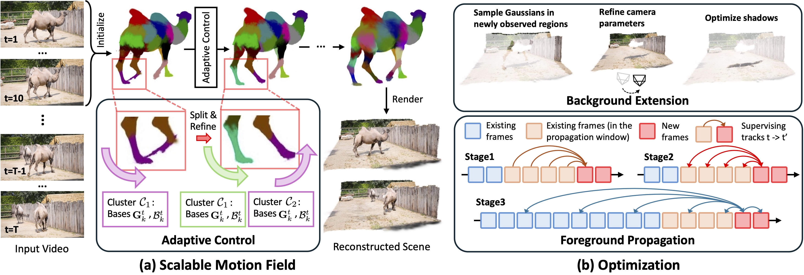

# MotionScale: Reconstructing Appearance, Geometry, and Motion of Dynamic Scenes with Scalable 4D Gaussian Splatting

<div align="center">
  <a href="https://arxiv.org/abs/2603.29296"></a>
  <a href="https://hrzhou2.github.io/motion-scale-web/"></a>
  <a href="https://huggingface.co/datasets/hrzhou2/motion-scale"></a>

</div>


## Overview



**MotionScale** reconstructs dynamic 4D scenes — appearance, geometry, and motion — from a single monocular video. Given any in-the-wild video, it produces a full 4D Gaussian Splatting representation that supports:

- **Novel view synthesis** — render the scene from any camera viewpoint at any time step
- **Dense 3D point tracking** — track every point in the scene through time in 3D

---

## Installation

```bash
git clone --recurse-submodules https://github.com/hrzhou2/motion-scale
cd motion-scale/
conda create -n motion_scale python=3.10
conda activate motion_scale
```

Install dependencies (tested on CUDA 12.x):

```bash
bash install.sh
```

This installs all Python dependencies and builds [gsplat](https://github.com/nerfstudio-project/gsplat) from source.

---

## Data Processing

**Download DAVIS:** Go to the [DAVIS 2017 download page](https://davischallenge.org/davis2017/code.html) and download the raw dataset. Extract so that the dataset sits at `<data_dir>/DAVIS/`.

**Download preprocessed data:** We provide preprocessed data for the DAVIS sequences used in our paper — download it from [HuggingFace](https://huggingface.co/datasets/hrzhou2/motion-scale). Extract it so that it sits at `<data_dir>/DAVIS/flow3d_preprocessed/`.

To preprocess your own sequences, see [preproc/README.md](./preproc/README.md) for the full pipeline.

---

## Training

First, set `data_dir` in `configs/davis/default.yaml` to your DAVIS dataset path:

```yaml
work_dir: '/path/to/output/'
data_dir: '/path/to/DAVIS/'
```

Then run:

```bash
conda activate motion_scale
python run_training.py --config configs/davis/default.yaml --seq_name camel --exp_name new_run
```

Run `python run_training.py --help` to see all available options. Outputs (checkpoints, videos, TensorBoard logs) are saved to `<work_dir>/<exp_name>/`.

---

## Interactive Rendering

After training, launch the interactive viewer:

```bash
python run_rendering.py --work_dir <OUTPUT_DIR> --port 8890
```

This loads `<OUTPUT_DIR>/checkpoints/last.ckpt` and starts a [viser](https://github.com/nerfstudio-project/viser)-based viewer at `localhost:8890`.

---


## Citation

```bibtex
@article{zhou2026motionscale,
  title={MotionScale: Reconstructing Appearance, Geometry, and Motion of Dynamic Scenes with Scalable 4D Gaussian Splatting},
  author={Zhou, Haoran and Lee, Gim Hee},
  journal={arXiv preprint arXiv:2603.29296},
  year={2026}
}
```