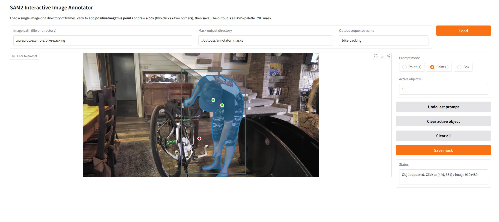

## Overview

The preprocessing pipeline runs in two stages using two separate conda environments:

1. **`motion_scale` env** — depth estimation, mask propagation, and 2D point tracking
2. **`mega_sam` env** — camera SLAM/reconstruction using the outputs from stage 1

Dependencies used:
- [Pi3](https://github.com/yyfz/Pi3) — depth estimation
- [MoGe](https://github.com/microsoft/MoGe) — metric depth and surface normals
- [SAM2](https://github.com/facebookresearch/sam2) — video object mask segmentation
- [CoTracker3](https://github.com/facebookresearch/co-tracker) — 2D point tracking
- [Mega-SAM](https://github.com/mega-sam/mega-sam) — camera SLAM (separate env)

---

## Installation

### `motion_scale` environment

**1. Initialize submodules** (if not already populated)
```bash
git submodule update --init preproc/Pi3 preproc/sam2 preproc/co-tracker
```

**2. Install packages**
```bash
conda activate motion_scale
bash preproc/setup_dependencies.sh
```

**3. Download checkpoints**
```bash
bash preproc/download_checkpoints.sh
```

### `mega_sam` environment

Mega-SAM depends on an older PyTorch version (2.0.1) that conflicts with the main environment. We recommend creating a separate conda environment for it using the provided `environment.yml`.

**1. Initialize submodule** (if not already populated)
```bash
git submodule update --init preproc/mega-sam
```

**2. Create the conda environment**
```bash
cd preproc/mega-sam
conda env create -f environment.yml
```

Follow any additional install steps in `preproc/mega-sam/README.md`.

---

## Running

```bash
# Stage 1
conda activate motion_scale
python preproc/process_davis.py --base_dir /path/to/DAVIS/

# Stage 2
conda activate mega_sam
python preproc/process_davis_megasam.py --base_dir /path/to/DAVIS/
```

---

## Shadow masks (optional)

Shadow masks are not part of the automated pipeline and must be annotated manually. We provide an interactive Gradio annotator for this:

```bash
conda activate motion_scale
python preproc/interactive_image_annotator.py --ckpt preproc/checkpoints/sam2.1_hiera_base_plus.pt --cfg  configs/sam2.1/sam2.1_hiera_b+.yaml
```

Load a sequence directory, click to prompt objects (positive/negative points or bounding box), and save the first-frame mask. The output is a DAVIS-palette PNG at `<out_dir>/<seq_name>/<frame_stem>.png`.



Once the first-frame masks are ready, propagate them to all frames with SAM2:

```bash
python preproc/compute_shadows_all.py \
    --img_base_dir /path/to/DAVIS/JPEGImages/480p/ \
    --input_mask_dir /path/to/annotator_masks/ \
    --out_base_dir /path/to/flow3d_preprocessed/480p/
```

This writes shadow masks to `<out_base_dir>/<seq>/sam2_shadows/`.

---

## Output structure

Both scripts write into a shared output directory (default: `<base_dir>/flow3d_preprocessed/`):

```
- flow3d_preprocessed/480p/<seq_name>/
    |- pi3/             # Pi3 metric depth maps
    |- moge/            # MoGe depth, normals, and intrinsics
    |- sam2_masks/      # SAM2 object mask PNGs
    |- sam2_shadows/    # SAM2 shadow mask PNGs (optional, see above)
    |- cotracker3/      # CoTracker3 2D point tracks
    |- megasam/         # Mega-SAM camera poses and reconstruction
```
